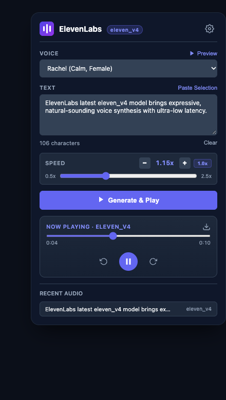

# ElevenLabs Voice Reader

A modern WebExtension for Firefox and Chromium browsers that reads any text aloud using your ElevenLabs API key and the **`eleven_v4`** model.

<p align="center">
  
</p>

---

## Highlights

- **Latest `eleven_v4` Model**: Configured to use ElevenLabs' `eleven_v4` model ID for natural, high-fidelity voice output.
- **In-Page Floating Player**: Highlight any text on any webpage, right-click, and choose **"Read with ElevenLabs (eleven_v4)"** to listen through a floating playback widget.
- **Fine Speed Adjustment**: Control playback speed from **0.50x to 2.50x** with **0.05x precision steps**, nudge buttons (`−` / `+`), and a **1.0x** reset badge.
- **Interactive Popup**:
  - Live character counter.
  - "Paste Selection" button to fetch text from the current browser tab.
  - Voice selection with sample audio preview.
  - Built-in audio player with time scrubber, 5-second skips, and MP3 download.
  - Local history list to replay previous audio clips without spending extra API credits.
- **Settings & Privacy**:
  - Secure local API key storage.
  - Real-time account quota and tier verification.
  - Fully compliant with Mozilla's data collection and privacy specifications.

---

## Build & Package

To package the extension into an installable `.zip` file:

```bash
# Clone the repository
git clone https://github.com/dong0085/elevenlabs-voice-reader.git
cd elevenlabs-voice-reader

# Package the extension
zip -r elevenlabs-voice-reader.zip \
  manifest.json \
  background.js \
  content.js \
  content.css \
  popup/ \
  icons/ \
  README.md
```

You can also use Mozilla's official developer tool:

```bash
npx --yes web-ext build
```

---

## Installation

### Firefox

#### Temporary Development
1. Open Firefox and go to `about:debugging#/runtime/this-firefox`.
2. Click **Load Temporary Add-on...**.
3. Select `manifest.json`.

#### Permanent Installation (Self-Distribution)
1. Build the zip file using the command above.
2. Go to the [Mozilla Add-on Developer Hub](https://addons.mozilla.org/developers/).
3. Select **"On your own"** (unlisted distribution).
4. Upload your zip file. Mozilla signs it automatically within a few minutes.
5. Download the signed `.xpi` file and drag it into regular Firefox.

---

### Chrome / Brave / Edge

1. Open `chrome://extensions`.
2. Enable **Developer mode** in the top-right corner.
3. Click **Load unpacked** and select the extension repository folder.

---

## Getting Started

1. Click the **ElevenLabs Voice Reader** icon in your browser toolbar.
2. Open settings (gear icon) and enter your ElevenLabs API key.
3. Click **Verify & Refresh** to confirm your account status and load your available voices.
4. Click **Save Settings**.
5. Select text on any web page and right-click to listen, or enter text directly in the popup.

---

## License

MIT
